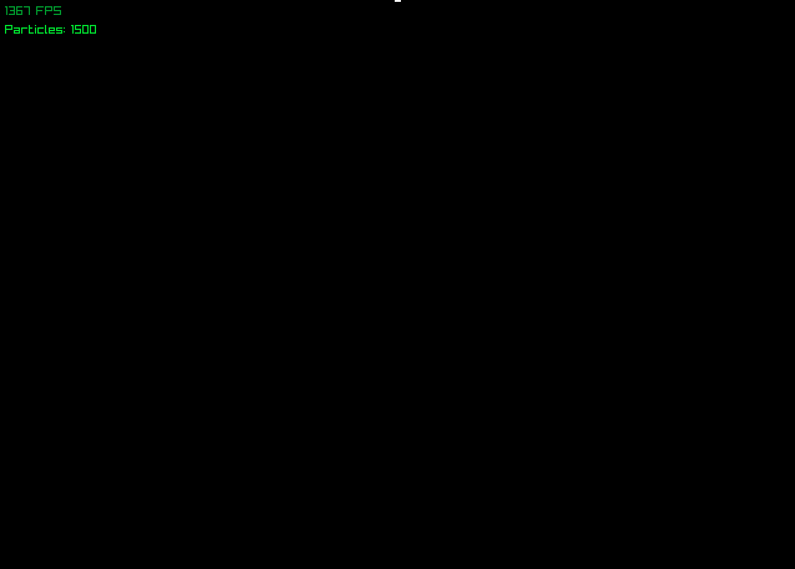

# Level 1: Particle Storm

High-performance CPU particle system with data-oriented design.



## Performance

| Metric | Result |
|:-------|:-------|
| Particles | 100,000 @ 60 FPS |
| Runtime Allocation | Zero |

## Technical Highlights

### SOA Data Layout

```cpp
// Instead of: Particle particles[N]
float position_x[N], position_y[N];
float velocity_x[N], velocity_y[N];
```
Cache-friendly, SIMD-optimizable.

### Swap-and-Pop Lifecycle

```cpp
void kill(size_t i) {
    swap(data[i], data[--active_count]);
}
```
O(1) removal, zero allocation, branch-free update.

### Batch Rendering

| Method | Draw Calls | FPS |
|:-------|:-----------|:----|
| `DrawCircle` per particle | 100,000 | 35 |
| `rlgl` batched | 1 | 60 |

## Build and Run

```bash
cmake -B build -DCMAKE_BUILD_TYPE=Release
cmake --build build -j$(nproc)
./bin/L1_ParticleStorm
```

## Architecture

```
main.cpp:  Emitter ──► Update ──► Render
                         │
                         ▼
           ParticleSystem (SOA arrays)
           [active...    ][unused...]
                         ↑ active_count
```
